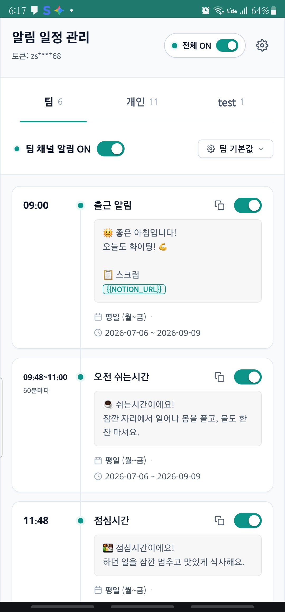
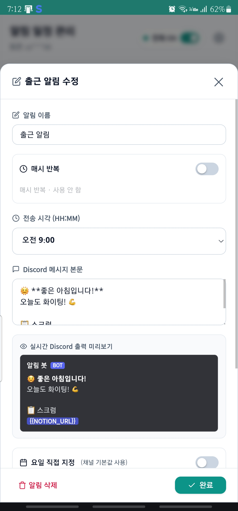
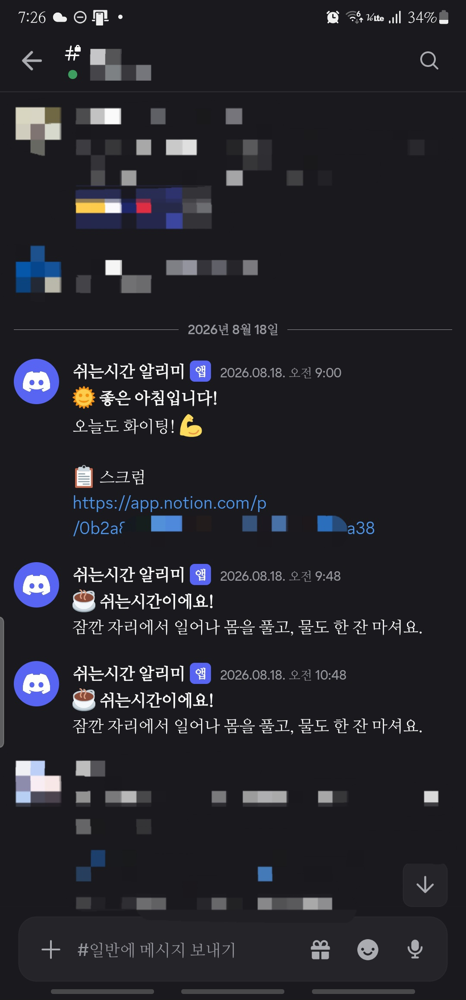

# Discord Work Rhythm Reminder

Cloudflare Workers를 이용해 **Discord로 업무 리듬 알림을 자동 전송**하는 서버리스 프로젝트입니다.

출근, 쉬는시간, 점심시간, 스크럼, 퇴근 등 반복되는 업무 일정을 Discord 채널로 자동 안내합니다.

[데모 바로가기](https://discord-break-reminder.soleil666111.workers.dev/)

<!--
<p align="center">
  
</p>
-->

<table>
  <thead>
    <tr>
      <th width="33%">알림 목록</th>
      <th width="33%">알림 수정</th>
      <th width="33%">디스코드 알림</th>
    </tr>
  </thead>
  <tbody>
    <tr>
      <td align="center">
        
      </td>
      <td align="center">
        
      </td>
      <td align="center">
        
      </td>
    </tr>
  </tbody>
</table>

## ✨️ 주요 기능

* 🌞️ 출근 알림
* ☕️ 쉬는시간 알림
* 🍱️ 점심시간 알림
* ⏰️ 점심 종료 안내
* 📋️ 스크럼 링크 안내
* 🎉️ 퇴근 알림
* 📅️ 요일별 실행
* 📆️ 기간(Start/End Date) 설정
* 🔁️ 반복 알림 (예: 매시 정각 반복)
* ✅️ 알림별 ON/OFF
* 📢️ 채널 단위로 분리된 여러 Discord Webhook 전송
* 🔤️ 환경 변수 기반 메시지 치환(`{{NOTION_URL}}`)
* 🗂️ Cloudflare KV 기반 일정 저장 (파일 수정 없이 API로 변경)
* 🖥️ 웹 관리 화면에서 채널·일정 편집 및 탭 순서 드래그 정렬
* 🔐️ 토큰 기반 관리 API 인증, 브라우저 저장으로 자동 로그인
* 📲️ PWA 지원 — 홈 화면에 추가해 독립 앱처럼 실행, maskable 아이콘
* 🧪️ 테스트 메시지 전송(`/test`)

## 🛠️ Tech Stack

* JavaScript (ES Modules)
* Cloudflare Workers
* Cloudflare Workers KV
* Cloudflare Cron Triggers
* Discord Webhook

## 📁️ 프로젝트 구조

```text
.
├── src/
│   ├── index.js          # Worker 진입점 (라우팅, 인증, KV 로드/폴백, 전송, manifest.json·아이콘 서빙)
│   ├── icons.js           # 아이콘 PNG를 base64로 담은 번들 (직접 수정 금지)
│   ├── adminUi.js         # admin-ui.html을 문자열로 감싼 배포용 번들 (직접 수정 금지)
│   ├── admin-ui.html      # 관리 화면 소스 (수정은 항상 이 파일에서)
│   └── schedule/
│       ├── index.js      # 파일 기반 폴백 데이터 조립, 채널 구조 평탄화(normalizeSchedule)
│       ├── settings.js   # GLOBAL_SETTINGS (전체 ON/OFF, 채널별 기본값)
│       ├── team.js       # 팀 채널 알림 목록
│       └── personal.js   # 개인 채널 알림 목록
├── scripts/
│   ├── build-admin-ui.mjs  # admin-ui.html → adminUi.js 재생성 스크립트
│   └── generate-icons.mjs  # 아이콘 PNG를 직접 인코딩해 src/icons.js 재생성 스크립트
├── docs/
│   └── discord-work-rhythm-reminder-plan.md  # 기획서
├── package.json
├── wrangler.jsonc
└── README.md
```

## 🚀️ 실행 방법

### 1. 설치

```bash
npm install
```

### 2. Cloudflare 로그인

```bash
npx wrangler login
```

### 3. KV 네임스페이스 생성

일정 데이터는 Cloudflare KV(`SCHEDULE_KV`)에 저장합니다.

```bash
npx wrangler kv namespace create SCHEDULE_KV
```

출력된 `id`를 `wrangler.jsonc`의 `kv_namespaces`에 넣습니다.

```jsonc
"kv_namespaces": [
  { "binding": "SCHEDULE_KV", "id": "여기에_생성된_id" }
]
```

### 4. Secret 3개 등록

| 시크릿 | 필수 | 설명 |
|---|---|---|
| `DISCORD_WEBHOOK_URLS` | ✅️ | 채널 이름별 Discord Webhook URL의 JSON 객체 (배열도 허용) |
| `NOTION_URL` | ✅️ | 출근 알림 등 메시지에서 `{{NOTION_URL}}`로 치환되는 값 |
| `ADMIN_TOKEN` | ✅️ | 관리 API(`/api/*`, `/admin/*`, `/test`) 인증에 쓰는 토큰 |

```bash
npx wrangler secret put DISCORD_WEBHOOK_URLS
npx wrangler secret put NOTION_URL
npx wrangler secret put ADMIN_TOKEN
```

`DISCORD_WEBHOOK_URLS` 예시(JSON 객체 — 채널 이름을 키로 사용, 이 키가 곧 전송 대상 채널명)

```json
{
  "personal": "https://discord.com/api/webhooks/...",
  "team": "https://discord.com/api/webhooks/..."
}
```

`ADMIN_TOKEN`은 원하는 임의의 문자열이면 됩니다. 이 값을 쿼리 파라미터 `?key=`로 넘겨 관리 API를 호출합니다.

`WEBHOOK_NAME`(Discord에 표시될 발신자 이름)은 시크릿이 아니라 `wrangler.jsonc`의 `vars`에 있으며 기본값은 `쉬는시간 알리미`입니다.

### 5. 배포

```bash
npm run deploy
```

### 6. KV 초기화

배포 직후 KV가 비어 있으면 Worker는 `src/schedule/` 안의 파일 데이터를 폴백으로 사용합니다. KV에 실제 데이터를 채우려면 아래를 한 번 호출합니다. 이미 값이 있으면 거부합니다(실수로 덮어쓰지 않도록).

```text
POST https://<worker>.workers.dev/admin/init?key=<ADMIN_TOKEN>
```

## 🖥️ 관리 화면

```text
GET https://<worker>.workers.dev/
```

인증 없이 누구나 화면 자체는 열립니다. 화면에 뜨는 토큰 입력창에 `ADMIN_TOKEN`을 넣어야 실제 일정 데이터를 불러오고 저장할 수 있습니다. 입력한 토큰은 브라우저 `localStorage`에 저장되어 다음 방문부터 URL에 `?key=`가 없어도 자동 로그인되며, 설정 메뉴의 "토큰 재설정"을 누르면 저장값을 지우고 다시 입력 화면으로 돌아갑니다.

화면에서 할 수 있는 것:
- 채널별 일정 목록 조회·추가·수정·삭제
- 채널 ON/OFF, 요일, 기간(startDate/endDate) 설정
- 채널 탭을 길게 눌러 드래그하면 탭 표시 순서 변경(`settings.channelOrder`에 저장, 마우스·터치 모두 지원)
- 편집 시트에서 "매시 반복" 토글을 켜면 시작·종료 시각과 간격(분)을 지정해 구간 반복 알림으로 전환 가능
- 변경사항이 있을 때만 나타나는 저장 바로 한 번에 저장
- 설정 메뉴에서 토큰 재설정, 테마 전환, 홈 화면에 추가(PWA 설치, 아래 참고)

## 📡️ API 목록

`key` 표시가 있는 항목은 `?key=<ADMIN_TOKEN>` 쿼리 파라미터가 반드시 필요합니다. 누락되거나 틀리면 `401 {"error":"unauthorized"}`.

| 메서드 | 경로 | 인증 | 설명 |
|---|---|---|---|
| GET | `/` | ❌️ | 관리 화면(HTML) 서빙 |
| GET | `/manifest.json` | ❌️ | PWA 매니페스트(앱 이름·테마색·아이콘 목록) |
| GET | `/icon-*.png`, `/apple-touch-icon.png`, `/favicon.png` | ❌️ | 홈 화면·파비콘용 아이콘 PNG 서빙 |
| GET | `/test` | ✅️ | 등록된 모든 웹훅으로 테스트 메시지 전송 |
| GET | `/api/channels` | ❌️ | `DISCORD_WEBHOOK_URLS`의 채널 이름 목록만 반환 (URL은 절대 포함 안 함) |
| GET | `/api/schedule` | ✅️ | KV에 저장된 일정 JSON 반환. KV가 비어 있으면 파일 폴백 데이터 반환 |
| PUT | `/api/schedule` | ✅️ | 본문 JSON을 검증 후 KV에 전체 교체 저장. 형식이 틀리면 `400 {"error":"사유"}` |
| POST | `/admin/init` | ✅️ | 파일 데이터를 KV에 최초 저장. 이미 값이 있으면 `409`로 거부 |
| POST | `/admin/migrate` | ✅️ | 구 구조(`team`/`personal` + `targets`) KV 데이터를 채널 구조로 변환. 원본은 `schedule.backup` 키에 보관. 이미 새 구조면 `409` |

## ⚙️ 일정 데이터 구조 (채널 단위)

KV에 저장되는(그리고 `PUT /api/schedule`가 받는) 형태는 다음과 같습니다. 채널 키 이름이 곧 `DISCORD_WEBHOOK_URLS`의 전송 대상이며, `targets` 필드는 더 이상 쓰지 않습니다.

```json
{
  "settings": {
    "enabled": true,
    "channelOrder": ["personal", "team"]
  },
  "channels": {
    "team": {
      "enabled": true,
      "days": ["Mon", "Tue", "Wed", "Thu", "Fri"],
      "startDate": "2026-07-06",
      "endDate": "2026-09-09",
      "items": [
        { "name": "출근 알림", "time": "09:00", "message": "🌞️ 좋은 아침입니다!" }
      ]
    },
    "personal": {
      "enabled": true,
      "days": ["Mon", "Tue", "Wed", "Thu", "Fri", "Sat", "Sun"],
      "startDate": "2026-09-06",
      "endDate": null,
      "items": [
        { "name": "출근 알림", "time": "09:00", "message": "🌞️ 좋은 아침입니다!" }
      ]
    }
  }
}
```

* `settings.enabled`: 전체 전송 스위치. `false`면 채널·아이템 설정과 무관하게 전송하지 않습니다.
* `settings.channelOrder`: 관리 화면에서 채널 탭을 보여주는 순서(선택). 알림 발송 로직에는 영향 없습니다.
* 각 채널은 자기 기본값(`enabled`, `days`, `startDate`, `endDate`)을 가지며, 채널 안의 `items` 각 항목은 같은 필드를 적으면 그 값이 채널 기본값보다 우선합니다.
* `name`, `time`(`HH:MM`, 한국 시간), `message`는 각 항목 필수. 그 외 필드는 선택.

파일 폴백(`src/schedule/`)을 수정하려면 `settings.js`(채널별 기본값), `team.js`/`personal.js`(각 채널 `items` 배열)를 고치고 재배포합니다. 폴백은 KV 읽기가 실패하거나 비어 있을 때만 쓰입니다 — 배포 후 `/admin/init`을 아직 안 돌렸거나 KV 바인딩 문제가 있어도 알림이 끊기지 않도록 하는 안전장치입니다.

### 구 구조에서 넘어오는 경우

이전에 `/admin/init`으로 초기화한 KV가 `{settings: {defaults: {...}}, team: [...], personal: [...]}` 형태(구 구조, `targets` 사용)라면 Worker는 이를 계속 읽어 알림을 정상적으로 보냅니다. 채널 단위 구조로 옮기려면:

```text
POST https://<worker>.workers.dev/admin/migrate?key=<ADMIN_TOKEN>
```

변환 전 원본은 `schedule.backup` 키에 그대로 보관됩니다.

## 🔤️ 메시지 템플릿

메시지 안의 `{{변수명}}`은 전송 직전에 같은 이름의 환경 변수 값으로 치환됩니다.

```json
{
  "name": "출근 알림",
  "time": "09:00",
  "message": "📋️ 스크럼\n{{NOTION_URL}}"
}
```

새로운 값을 쓰려면 메시지에 `{{MY_LINK}}`처럼 적고 시크릿을 등록하면 됩니다.

```bash
npx wrangler secret put MY_LINK
```

해당 이름의 환경 변수가 없으면 치환되지 않고 `{{MY_LINK}}`가 그대로 남습니다.

## 🖌️ 관리 화면(admin-ui.html) 수정 흐름

관리 화면은 단일 HTML 파일(`src/admin-ui.html`)로 되어 있고, Worker는 이를 JS 문자열로 감싼 `src/adminUi.js`를 통해 서빙합니다. `adminUi.js`는 직접 편집하지 않습니다 — 백틱(`` ` ``)이나 `${`가 그대로 들어있는 HTML을 템플릿 리터럴로 감싸면 깨지기 때문에, `JSON.stringify`로 안전하게 이스케이프한 결과물입니다.

1. `src/admin-ui.html`을 수정한다.
2. 번들을 재생성한다.
   ```bash
   npm run build:admin-ui
   ```
3. `src/adminUi.js`가 갱신됐는지 확인하고(git diff), 필요하면 `npm run dev`로 `GET /`를 열어 확인한다.
4. 배포한다.
   ```bash
   npm run deploy
   ```

`src/adminUi.js`를 커밋할 때는 항상 `src/admin-ui.html`과 함께 커밋합니다 — 소스와 번들이 어긋나면 다음 사람이 번들만 보고 잘못된 곳을 고치게 됩니다.

아이콘도 같은 원칙입니다. `scripts/generate-icons.mjs`가 그림을 코드로 그려 `src/icons.js`를 생성하므로, 아이콘 디자인(색·모양·크기)을 바꿀 때는 스크립트를 고친 뒤 재생성합니다.

```bash
npm run build:icons
```

## 📲️ 홈 화면 앱(PWA) 설치

관리 화면은 홈 화면에 추가하면 주소창 없이 독립된 앱처럼 실행됩니다.

- **Android(Chrome)**: 방문 시 조건이 맞으면 하단에 설치 유도 배너가 뜨고, "설치" 버튼을 누르면 바로 설치됩니다. 배너를 놓쳤거나 이미 닫았다면 우측 상단 설정 메뉴의 "홈 화면에 추가"를 누르면 됩니다.
- **iOS(Safari)**: 자동 설치 API가 없어 배너에는 "공유 버튼을 눌러 홈 화면에 추가하세요" 안내만 표시됩니다. 공유 버튼 → 홈 화면에 추가 순서로 직접 진행합니다.
- 설치 유도 배너는 이미 홈 화면 앱으로 실행 중이거나(standalone), 이전에 두 번 닫았으면 자동으로 뜨지 않습니다. 그래도 설정 메뉴의 "홈 화면에 추가"는 항상 눌러 쓸 수 있습니다.
- 아이콘은 강조색(`#1F7A6D`) 배경에 흰 시계 모양이며, Android의 원형/둥근사각형 아이콘 마스크에 맞춰 중앙 80% 안전영역 안에만 그려져 있습니다(maskable icon). 브라우저 탭 파비콘은 마스킹이 적용되지 않으므로 별도로 픽셀 자체가 원형인 이미지를 사용합니다.

## 🧪️ 테스트

```text
GET https://<worker>.workers.dev/test?key=<ADMIN_TOKEN>
```

등록된 모든 웹훅으로 테스트 메시지를 전송합니다.

## 📌️ 향후 계획

* Notion API 연동
* 공휴일 자동 제외
* 실행 이력 및 오류 알림

## 💡️ 개발 배경

장시간 원격 근무 중 쉬는시간과 점심시간을 자주 놓치는 경험에서 시작한 프로젝트입니다.

로컬 프로그램 대신 Cloudflare Workers를 사용하여 **컴퓨터가 꺼져 있어도** 알림이 계속 동작하도록 구현했습니다.

또한 채널 단위 일정 관리, KV 기반 저장, 웹 관리 화면을 통해 파일을 직접 고치지 않고도 개인 및 팀 알림을 함께 운영할 수 있도록 설계했습니다.

## License

MIT
